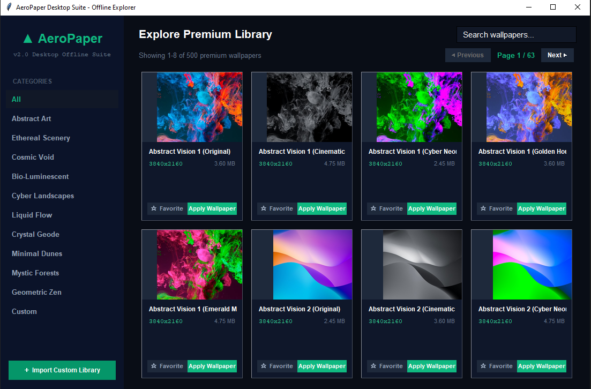
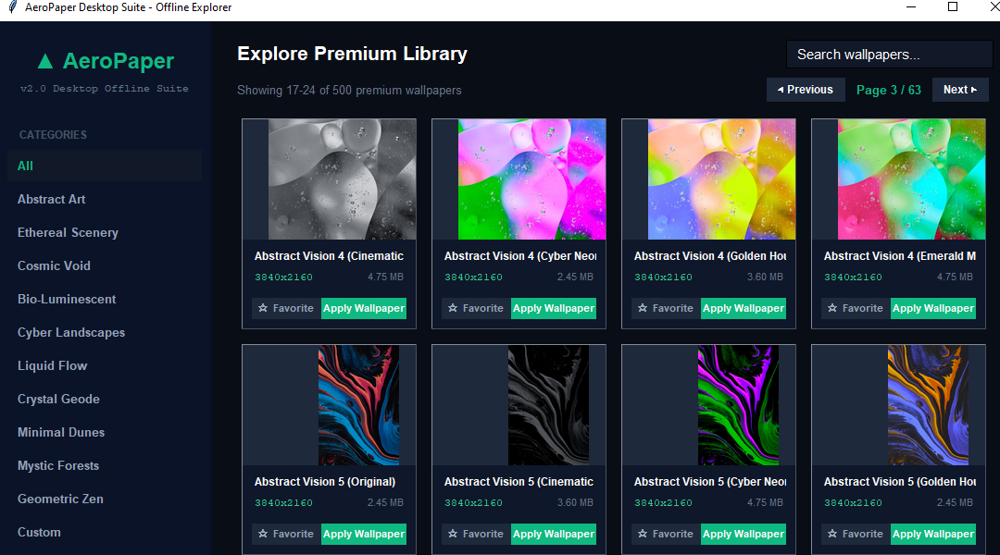

# AeroPaper Desktop Suite

  
  

*A lightweight desktop wallpaper application for Windows.*

## ✨ Features

- 🌐 Browse and download wallpapers from online libraries
- 🖼️ Apply wallpapers instantly with one click
- 📂 Import custom wallpaper collections
- 🔍 Search wallpapers in seconds
- 🗂️ Organize wallpapers by category
- 💾 Offline support for downloaded wallpapers
- ⚡ Lightweight and responsive desktop application
- 🖥️ Built for Windows 10 & Windows 11

## 📦 Installation

1. Download and extract the ZIP archive.
2. Open the project folder.
3. Run **AeroPaper.exe**.

> Windows may display a SmartScreen warning because the application is not digitally signed. This is normal for independently distributed applications.

## 📋 Requirements

* Windows 10 or Windows 11
* Internet connection only when downloading wallpapers

## 📂 Project

GitHub Repository:

**[https://github.com/AvgLucer/vibecoding/AeroPaper](https://github.com/AvgLucer/vibecoding/tree/main/AeroPaper)**

## 🐞 Issues & Feedback

Found a bug or have a suggestion? Please open an issue on the GitHub repository.

## 📄 License

This project is provided as-is for personal use unless otherwise specified.
~AvgLucer

