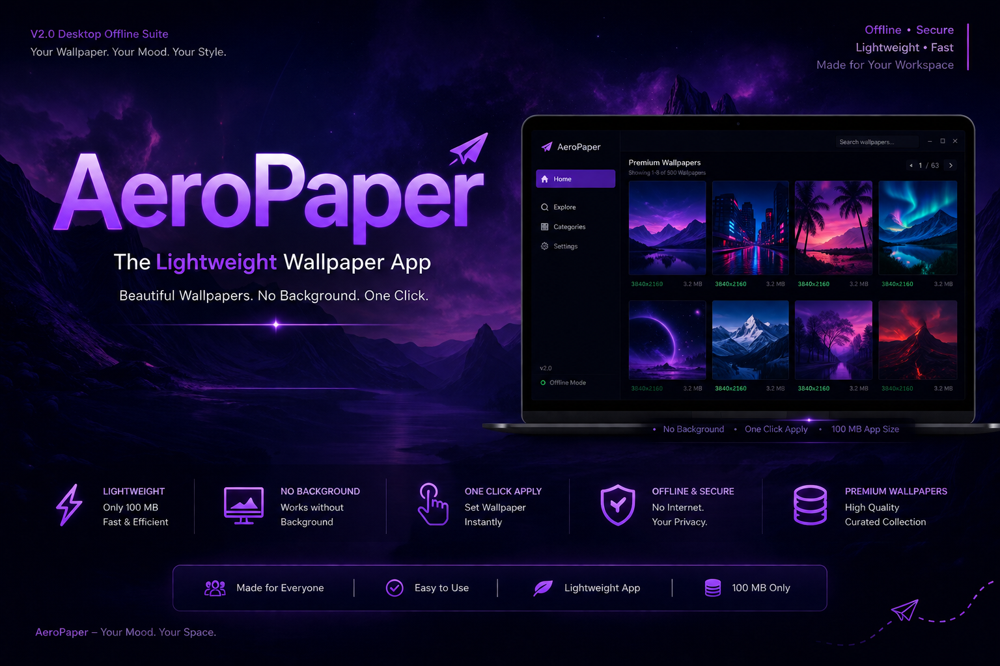

# 🖼️ AeroPaper


<p align="center">
  
</p>


> A lightweight, open-source wallpaper application that works both **offline** and **online**—no installation required.


---

## ✨ Features

- 🖼️ Browse beautiful wallpapers
- 🌐 Online wallpaper support
- 💾 Offline wallpaper collection included
- ⚡ Lightweight (~100 MB)
- 📦 Portable (No installation required)
- 🚀 Launch instantly
- 🔓 Fully Open Source
- 🪶 Minimal and clean interface

---

## 📸 Preview

> Add screenshots of the application here.

```
screenshots/
├── Home.png
├── Gallery.png
└── WallpaperPreview.png
```

---

## 🚀 Getting Started

### Download

Download the latest release from the **Releases** page.

---

### Run

No installation required.

Simply:

```
Extract AeroPaper.zip
        ↓
Open dist/
        ↓
Run AeroPaper.exe
```

That's it.

---

## 📁 Project Structure

```
AeroPaper/
│
├── dist/
│   └── AeroPaper.exe
│
├── assets/
├── wallpapers/
├── source/
├── README.md
└── LICENSE
```

---

## 🌐 Online Mode

- Browse wallpapers from supported online sources.
- Internet connection required.

---

## 💾 Offline Mode

The application includes built-in wallpapers, allowing it to work even without an internet connection.

Perfect for travel or systems without internet access.

---

## ⚙️ Requirements

- Windows 10 / 11
- No Python installation required
- No additional dependencies required

---

## 📦 Package Information

| Item | Value |
|------|------|
| Application | AeroPaper |
| Type | Portable |
| Installation | ❌ Not Required |
| Size | ~100 MB |
| Platform | Windows |
| Open Source | ✅ |

---

## 🛠️ Built With

- Python
- Pillow
- Requests
- Tkinter *(or CustomTkinter if used)*

---

## 🤝 Contributing

Contributions are welcome!

You can help by:

- Fixing bugs
- Improving performance
- Adding wallpaper sources
- Improving the UI
- Updating documentation

Fork the repository, create your feature branch, and submit a Pull Request.

---

## ⭐ Support

If you like AeroPaper, consider giving this repository a ⭐.

It helps the project grow and motivates future updates.

---

## 📄 License

This project is licensed under the MIT License.

See the LICENSE file for details.

---
[Note : This Project was Made Using Loop Engineering and Vibe Coding] 

[Note : Custom wallpaper feature is not yet supported , once access to the configuration will be added soon]

Made with ❤️ by **AvgLucer**


# ⚠️ Educational & Reference Use Only


> [!WARNING]
> ## Academic Integrity Notice
>
> This repository is published **solely for educational, learning, portfolio, and reference purposes**.
>
> You are welcome to:
> - ✅ Study the source code
> - ✅ Learn from the implementation
> - ✅ Experiment and modify it for personal learning
> - ✅ Build your own projects inspired by this work
>
> **However, you must NOT:**
> - ❌ Submit this repository (or a lightly modified version) as your own assignment or coursework.
> - ❌ Present this project as your own work in any **school, college, university, bootcamp, internship, hackathon, certification, or academic evaluation.**
> - ❌ Claim authorship of this project or any substantial portion of its implementation.
>
> If this project helps you, the expected approach is to **learn from it and create your own original implementation.** Please respect academic integrity and the time invested in developing this project.
